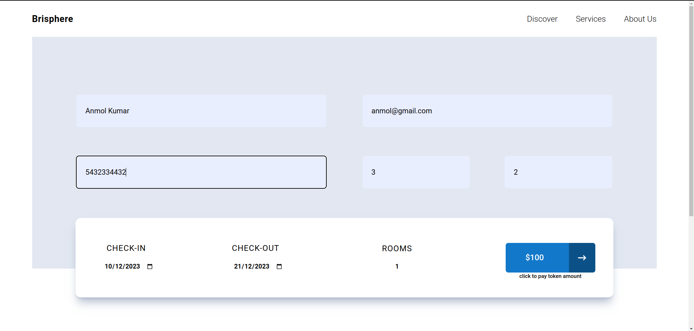

# Brisphere Hotel Landing Page
### Assignment for internship selection process.


This project is a landing page for the fictitious hotel "Brisphere," created as part of an Internshala assignment. The goal was to build a responsive and visually appealing website using Next.js for the frontend, Tailwind CSS for styling, and Context API for state management.

## Features

- **Next.js:** The project is built using the Next.js framework, providing a fast and efficient React application with server-side rendering and other performance benefits.

- **Tailwind CSS:** Tailwind CSS is used for styling, providing a utility-first approach and easy customization to achieve a modern and responsive design.

- **Context API:** The Context API is utilized for state management, allowing for efficient and centralized control of the application's state.

## Assignment Details

The project was part of an Internshala assignment with the following specifications:

- **Assignment Name:** Brisphere Hotel Landing Page
- **Deadline:** December 31, 2023
- **Actual Completion Date:** December 30, 2023

## Getting Started

To run the project locally, follow these steps:

```bash
        git clone https://github.com/AnmolDotX/brisphere_hotels.git
```
2. Install dependency:
```bash
        cd brisphere-hotel-landing
        npm install

```
3. Run the developement server:
```bash
    npm run dev
```
4. Open your browser and navigate to http://localhost:3000 to view the Brisphere Hotel Landing Page.

## Other Screenshots


